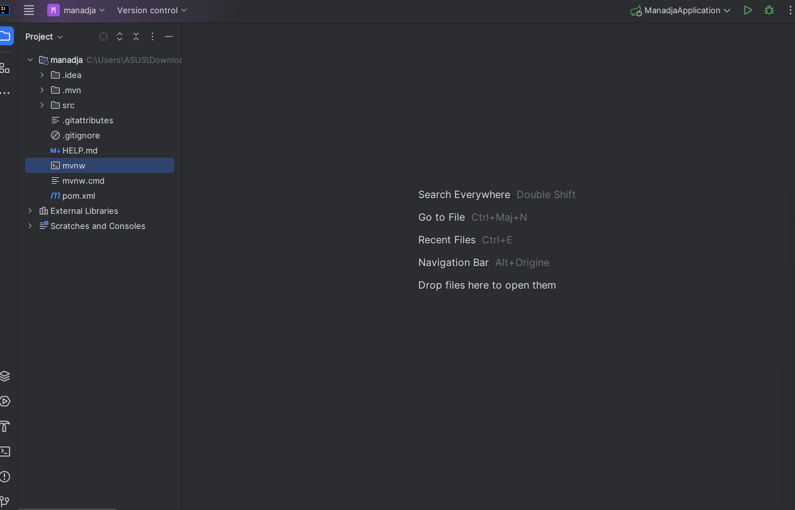
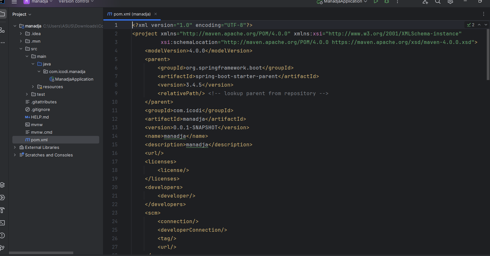
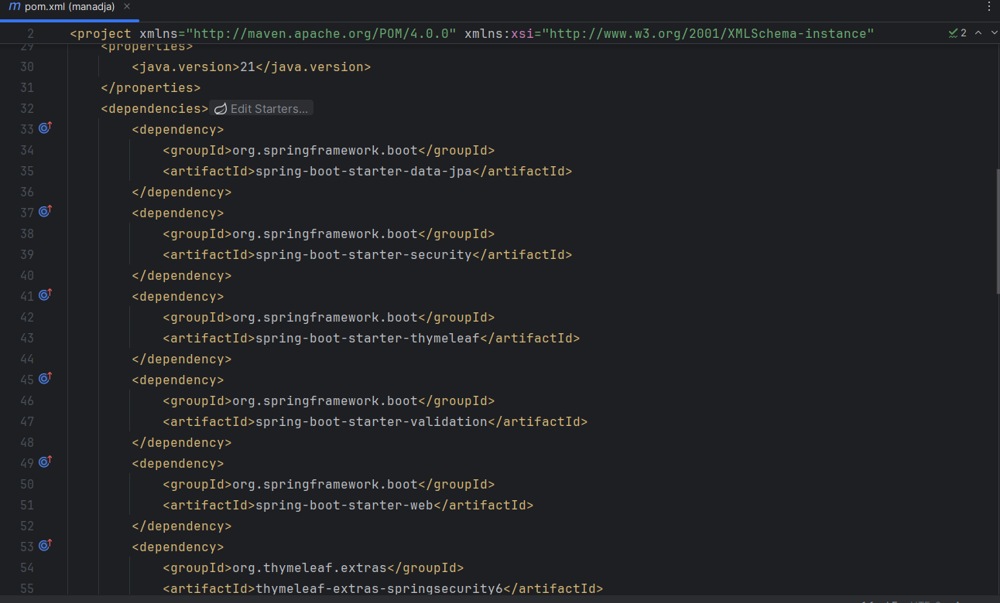
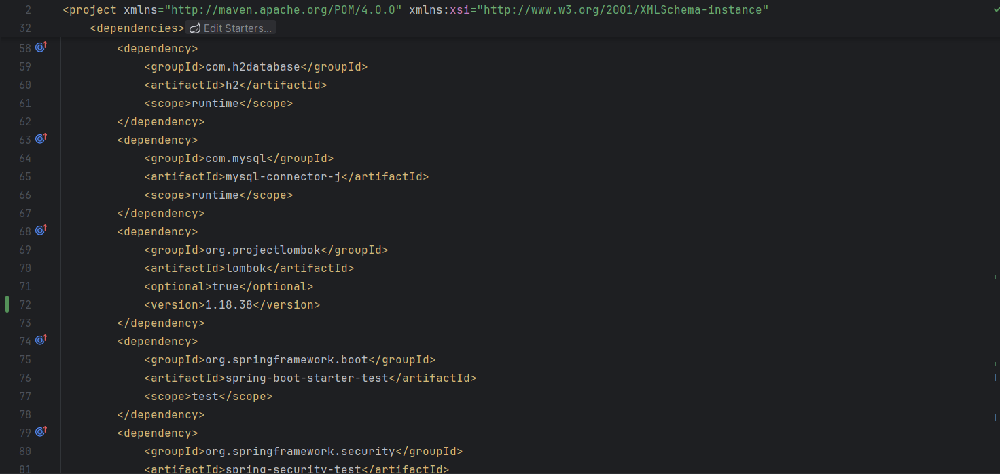
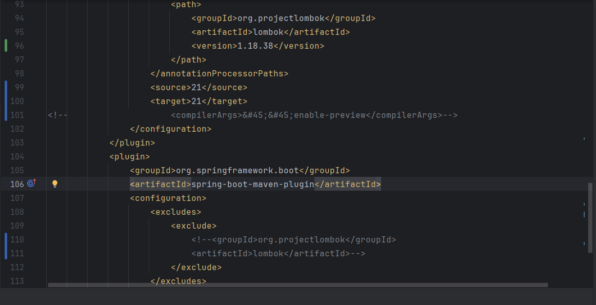
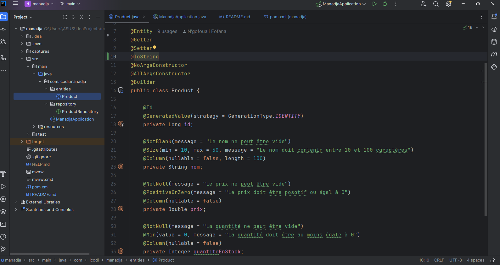
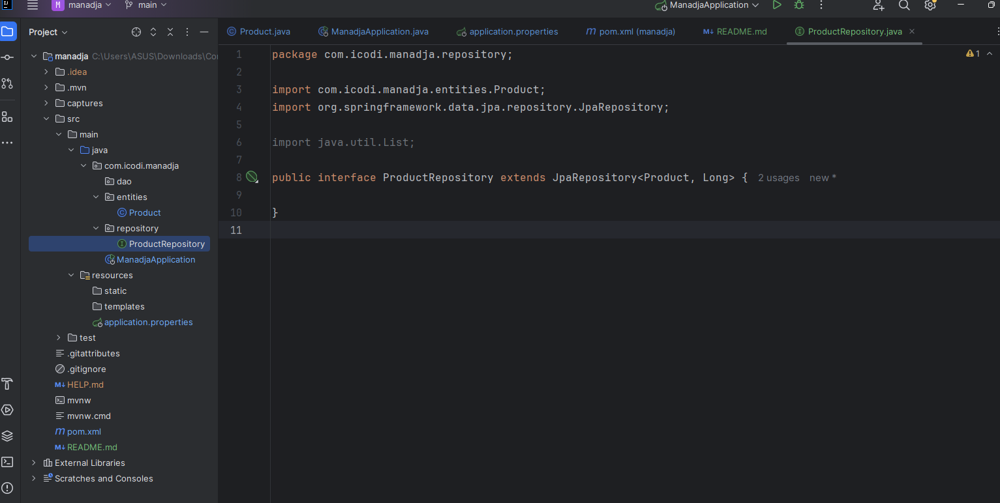
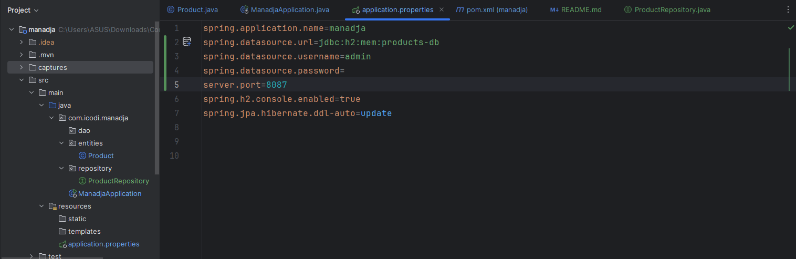
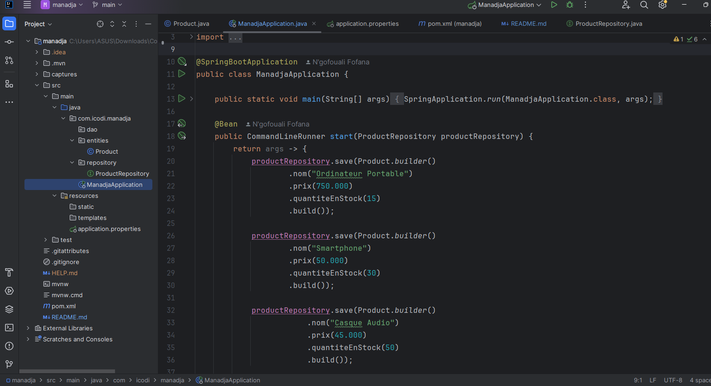
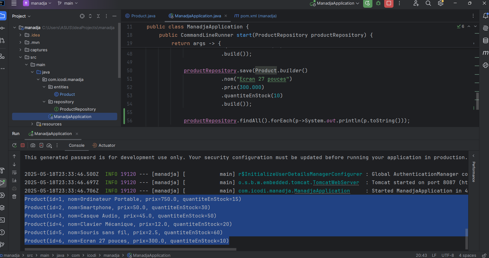

<h3>1. Création du projet Spring Boot avec les dépendances</h3>

 

<h4>Les dépendances via pom.xml</h4>

 

 

 

 
<h3>2. Création de l'entité JPA Product</h3>

 
<h3>3. Création de l'interface ProductRepository basée sur Spring Data</h3>

 
<h4>Configuration de la datasource H2</h4>

 
<h3>4. Test de la couche DAO</h3>
<ul>
<li>Classe principale ManadjaApplication.java</li>

<<<<<<< HEAD
<li>Test</li>

=======
</ul>
 
<ul>
<li>Test couche DAO</li>

>>>>>>> refs/remotes/origin/main
</ul>