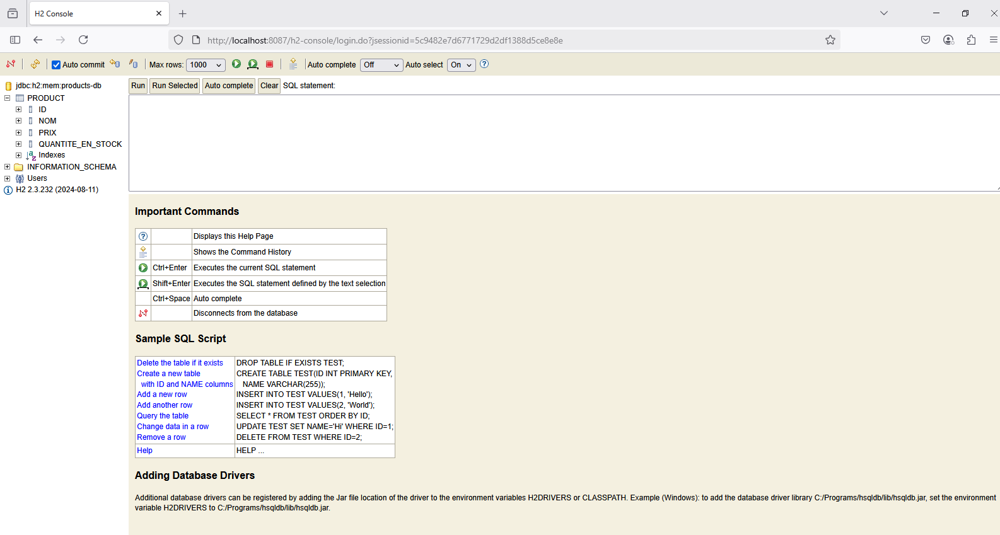

<h3>1. Création du projet Spring Boot avec les dépendances</h3>

 

<h4>Les dépendances via pom.xml</h4>

 

 

 

 
<h3>2. Création de l'entité JPA Product</h3>

 
<h3>3. Création de l'interface ProductRepository basée sur Spring Data</h3>

 
<h4>Configuration de la datasource H2</h4>

 
<h3>4. Test de la couche DAO</h3>
<ul>
<li><h4>Classe principale ManadjaApplication.java</h4></li>

<li><h4>Test</h4></li>

<li><h4>Test de connexion à la base H2 Database</h4></li>

</ul>
 
<h3>5. Désactivation de la protection par défaut de Spring Security</h3>

 
<h3>6. Création du contrôleur Spring MVC et des vues Thymeleaf</h3>
<ul>
<li><h4>Contrôleur pour afficher la liste des produits</h4></li>

<li><h4>Vue Thymeleaf pour l'affichage de la liste des produits</h4></li>

<li><h4>Contrôleur pour supprimer un produit</h4></li>

<li><h4>Vue Thymeleaf pour supprimer un produit</h4></li>

<li><h4>Page template basée sur Thymeleaf layout et Bootstrap</h4></li>

</ul>
